<!-- paginate: true -->

# Freenom で無料のドメイン名を取得する

- [Freenom \- 誰でも利用できる名前](https://www.freenom.com/ja/index.html)

---

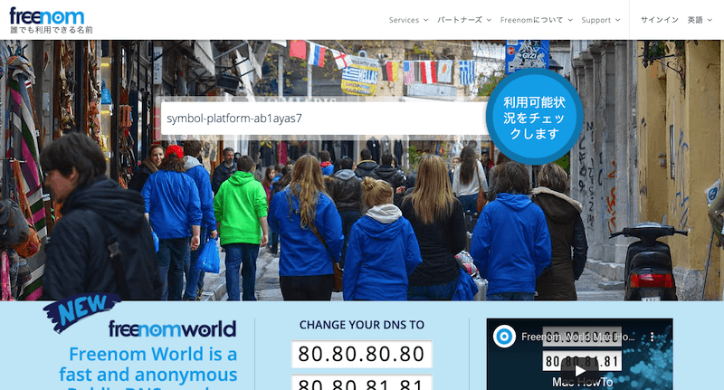
取得したい名前を入力してボタンを押します。
(使い捨てるつもりなので、かぶらないようにランダムな文字列を付け足した名前です)

---

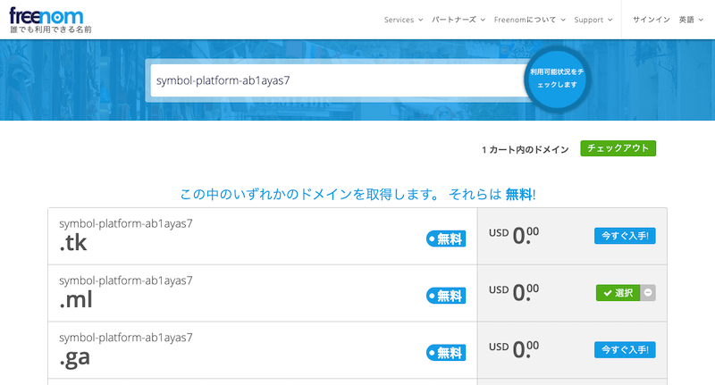
何種類かドメインが選べるので、お好きなものを選んでください。
「選択」にして、「チェックアウト」を押下してください。

---

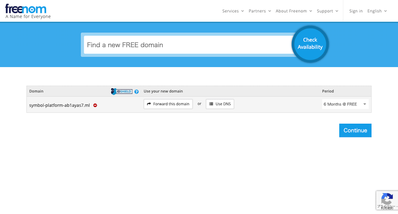
「Period」で有効期限を選択できます。

---

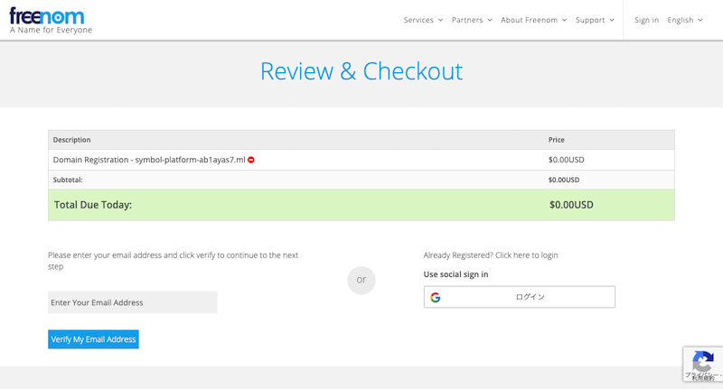
チェックアウトの確認です。
メールアドレスを入力して「Veridy My Email Address」を押下します。

---

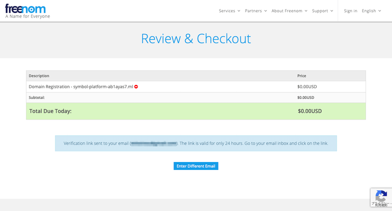
メールアドレスが送られてくるので確認してください。

---

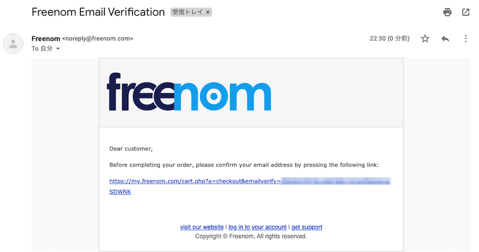
確認リンクを踏みます。

---

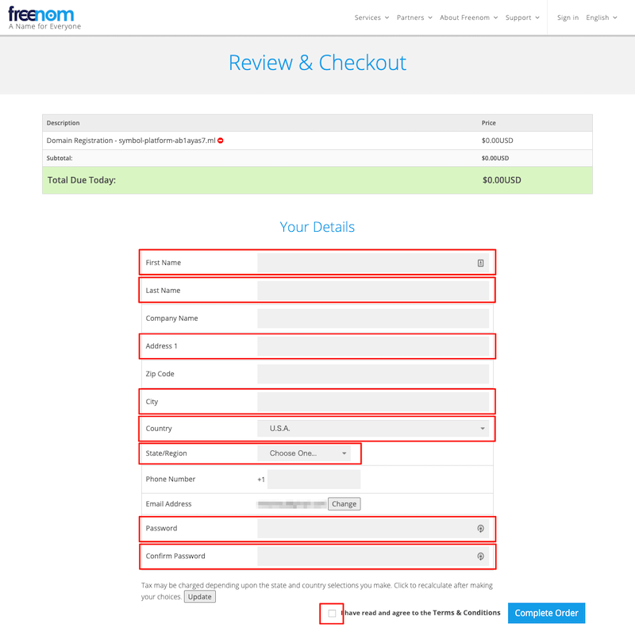
登録フォームへ遷移するので、必要な項目(赤いところ)を入力します。

---

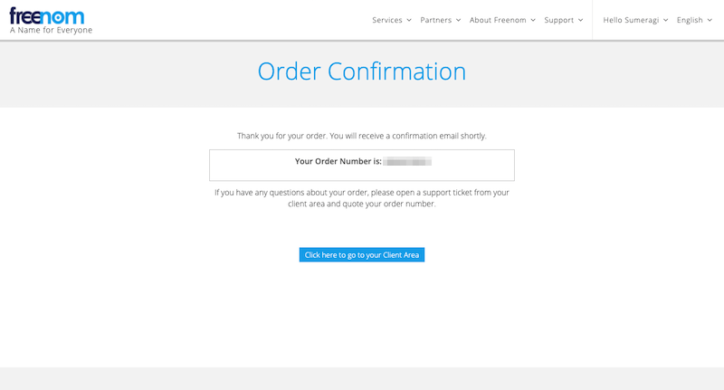
注文が確定しました。「Click here to go to your Client Area」を押下します。

---

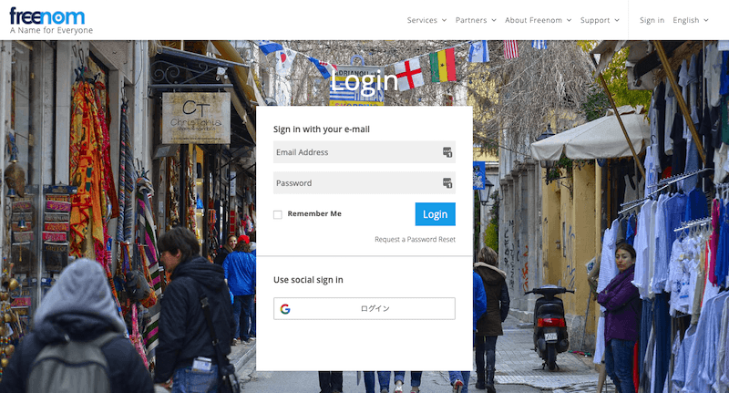
ログインを促されるので、先程のメールアドレスとフォームに入力したパスワードでログインします。

---

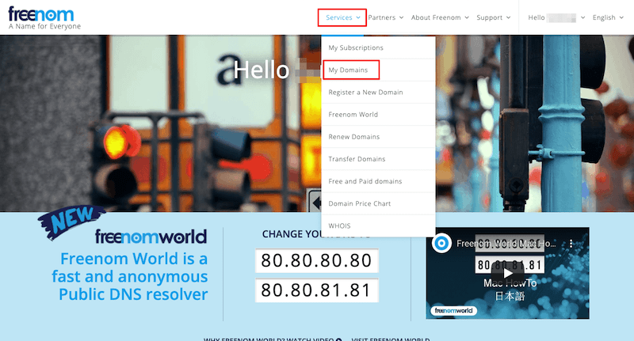
「Services」->「My Domains」を開きます。

---

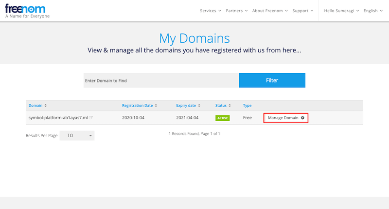
先程取得した名前でドメインがあるはずです。「Manage Domain」を押下します。

---

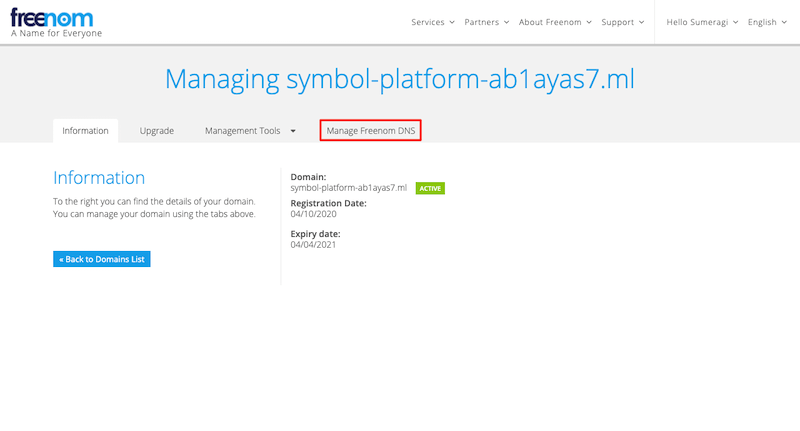
「Manage Freenom DNS」を押下します。

---

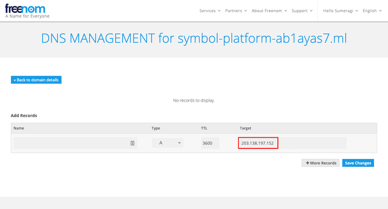
フォームが表示されるので「Target」にノードのIPアドレスを入力します。
「Save Changes」したら、しばらく待ちます。早ければ数分、遅ければ数日かかる可能性があります。
