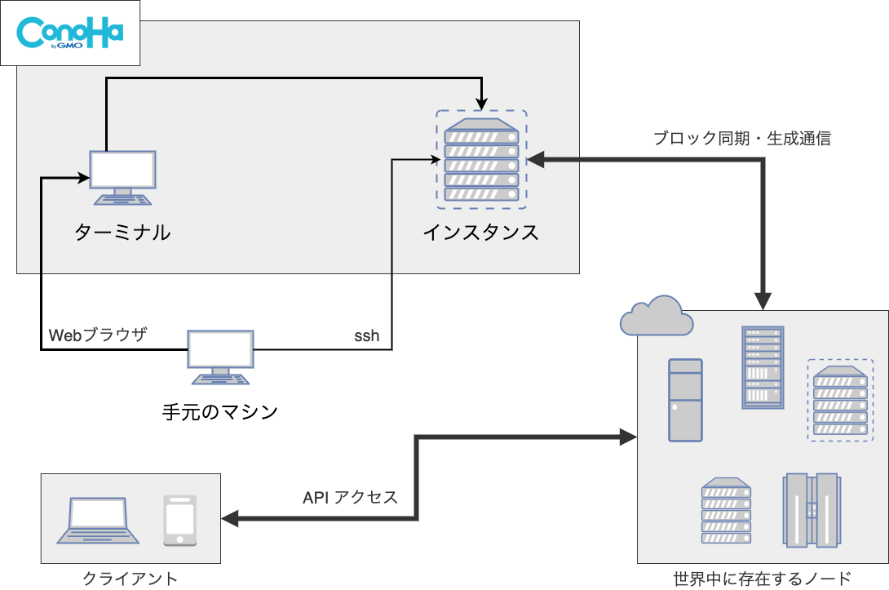
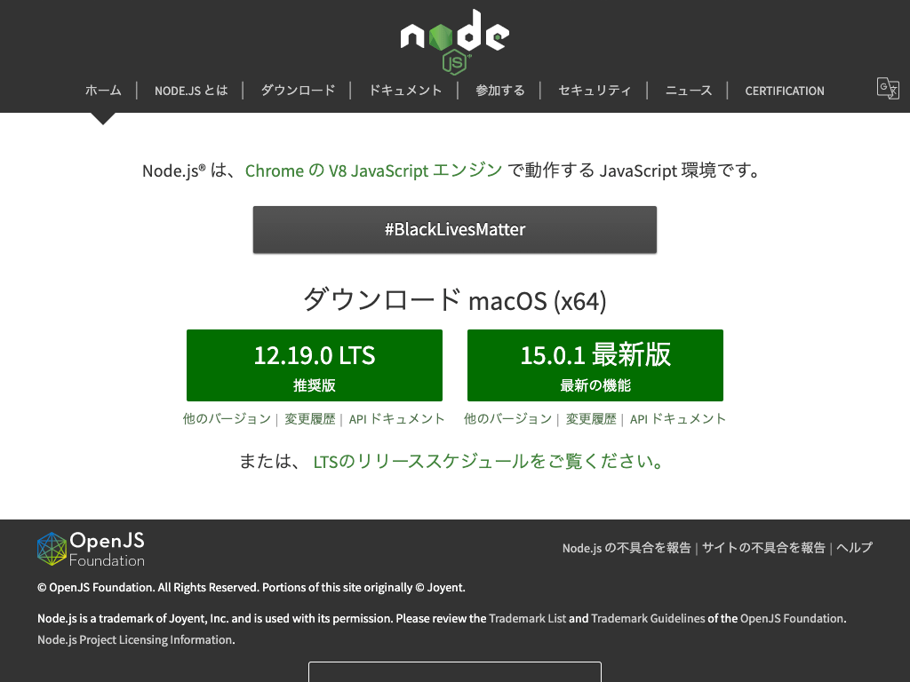
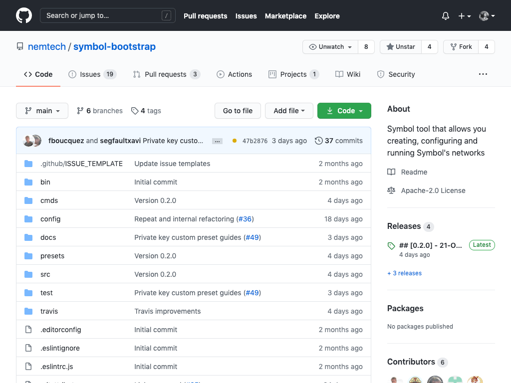
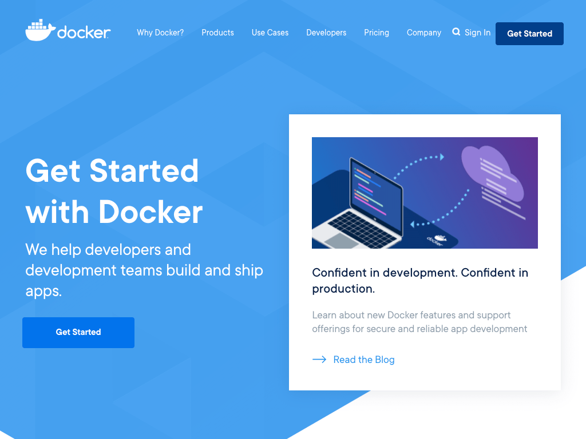
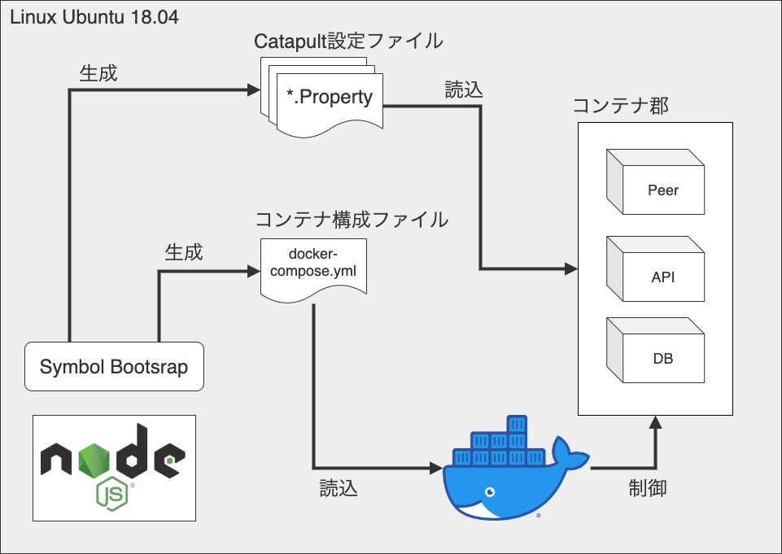
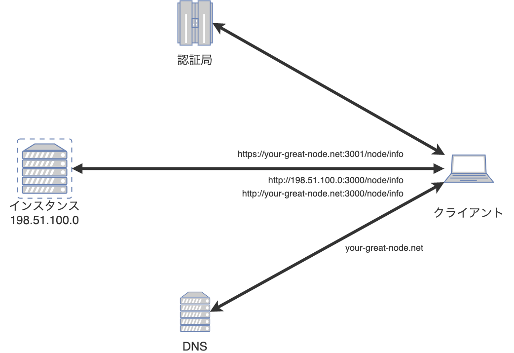
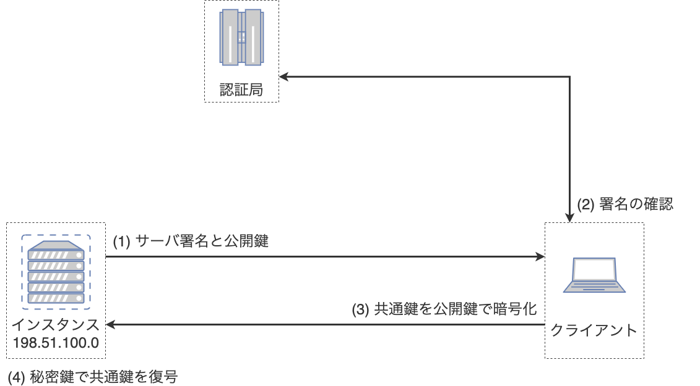
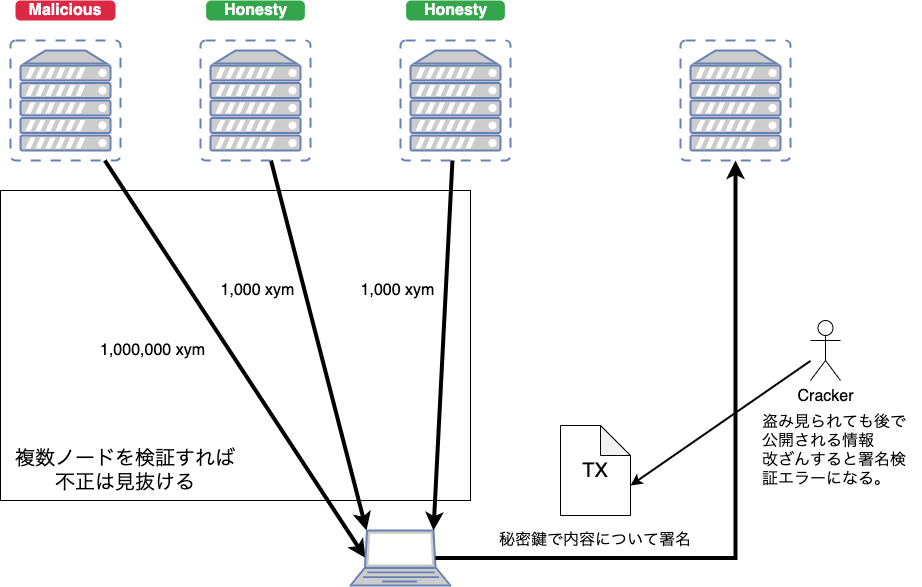
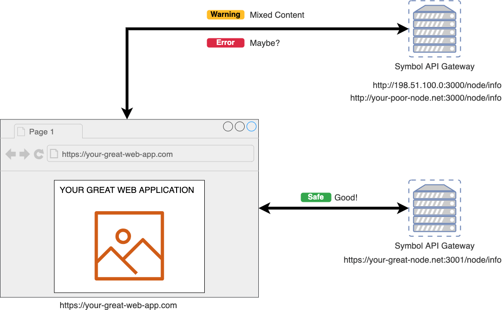
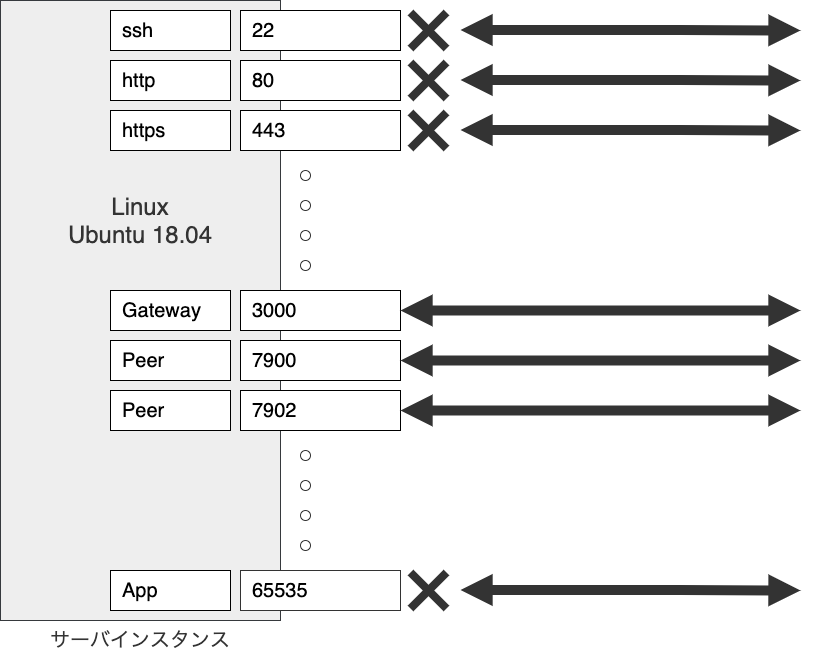

<!-- paginate: true -->

# Symbol TESTNET ノード構築ハンズオン

Date: 2020/11/14


---

## 自己紹介

よしゆき


- [ニズベールRさん \(@44uk\_i3\) / Twitter](https://twitter.com/44uk_i3)
- [次世代NEMではじめるブロックチェーンアプリケーション開発 \- nizveyl \- BOOTH](https://nizveyl.booth.pm/items/1549217)
    - 2019年7月 技術書典７にて
    - Elephant 🐘
    - 購入「非推奨」！！！

---

### 資料について

- [44uk / symbol-testnet-node-running-hands-on](https://github.com/44uk/symbol-testnet-node-running-hands-on)

ハンズオン資料はこのリポジトリにて公開します。

- [Symbolテストネットノードを建ててみた \(v0\.10\.x Hippo on Ubuntu Server 18\.04\)](https://nemlog.nem.social/blog/49345)

基本的にはすでに公開済みのこちらの記事と同じです。

---

## ハンズオンでやること

- 環境構築
- ノード起動設定ファイルの作成
- ノードの起動 / 停止
- サービス化の設定
- ドメイン設定 / HTTPS対応
- セキュリティ設定

---



---

## 環境構築

- Ubuntu 20.04 (Linux OS)
- Node.js (プログラム言語)
- npm (Node.js のパッケージ管理ツール)
- Symbol Bootstrap (Symbol ノードの便利ツール)
- Docker (コンテナ型仮想化ツール)
- DockerCompose (Docker の便利ツール)

上記の動作に必要なソフトウェアのインストールを行います。


---

### Node.js / npm



- [Node\.js](https://nodejs.org/ja/)

プログラミング言語 JavaScript の実行環境。

---

### Symbol Bootstrap



- [nemtech/symbol\-bootstrap: Symbol tool that allows you creating, configuring and running Symbol's networks](https://github.com/nemtech/symbol-bootstrap)

Symbol プラットフォームの様々な起動設定構成を生成するツール。
JavaScript (Node.js) で動作する。

---

### Docker / Docker Compose



実行環境のコンテナ仮想化ツール。

---

### コマンドサンプルの注釈

- `#`で始まる行はコマンドの入力です。
- それ以外はターミナルへの出力です。

```shell
# ls <- ターミナルへ入力する値
foo bar <- ターミナルに表示される結果
```

---

#### コマンド補完について

```shell
# ls tar <- tar まで入力したら tab キーを押す
# ls target <- target までが補完される
```

複数結果がある場合は、候補が表示されるので、絞り込めるまで入力してください。

---

#### コピペ用について

- コピペ用は`github`のリンクを開いた先からコピーしてください。
- PDF からは上手くコピーできない場合があります。

---

### Node.js / npm をインストール

```shell
# curl -sL https://deb.nodesource.com/setup_14.x | sudo -E bash -
# apt-get install -y nodejs
# npm install -g npm@latest
```
`Node.js 14.x`をインストールして、`npm`をアップデートします。

```shell
# node -v
v14.15.0
# npm -v
6.14.8
```
バージョンを表示して、インストールを確認します。

---


### Symbol Bootstrap をインストール

```shell
# npm install -g symbol-bootstrap@0.2.0
```
`symbol-bootstrap`をインストールします。

```shell
# symbol-bootstrap -v
symbol-bootstrap@0.2.0 linux-x64 node-v14.15.0
```
バージョンを表示して、インストールを確認します。

---

### Docker / DockerCompose のインストール

```shell
# apt-get install -y apt-transport-https ca-certificates curl gnupg-agent software-properties-common
# curl -fsSL https://download.docker.com/linux/ubuntu/gpg | apt-key add -
# apt-key fingerprint 0EBFCD88
# add-apt-repository "deb [arch=amd64] https://download.docker.com/linux/ubuntu $(lsb_release -cs) stable"
# apt-get update -y && apt-get install -y docker-ce docker-ce-cli containerd.io
```

```shell
# curl -L https://github.com/docker/compose/releases/download/1.27.4/docker-compose-$(uname -s)-$(uname -m) -o /usr/local/bin/docker-compose
# chmod +x /usr/local/bin/docker-compose
```
`docker`と`docker-compose`をインストールします。

```shell
# docker -v
Docker version 19.03.13, build 4484c46d9d
# docker-compose -v
docker-compose version 1.27.4, build 40524192
```
バージョンを表示して、インストールを確認します。

---



---

## ノード起動設定ファイルの作成

- Catapult サーバ / Rest 用の設定
- docker-compose.yml の設定


---

### ファイルの設置場所

```shell
# mkdir -p /opt/symbol-bootstrap
# cd /opt/symbol-bootstrap
```

以後、`/opt/symbol-bootstrap`がカレントディレクトリを前提とします。

---

### カスタム設定の用意

以下の内容で`my-preset.yml`としてファイルを作成します。
`vim`や`nano`などのテキストエディタで作成するか、
次ページのコピペ用を使用してください。

```yaml
nodes:
    -
        friendlyName: __YOUR_FRIENDLY_NAME__
gateways:
    -
        throttlingBurst: 70
        throttlingRate: 40
```

これらはデフォルトの設定を上書きするための値です。

`friendlyName`: ノードに任意の名前をつけるための文字列
`throttlingBurst`: APIの同時接続数上限(デフォルト: 35)
`throttlingRate`: APIの秒間リクエスト数上限(デフォルト: 20)

---

#### エディタ操作が難しい場合のコピペ用1

```shell
cat << _EOS_ >> my-preset.yml
nodes:
    -
        friendlyName: __YOUR_FRIENDLY_NAME__
gateways:
    -
        throttlingBurst: 70
        throttlingRate: 40
_EOS_
```

- [github - エディタ操作が難しい場合のコピペ用1](https://github.com/44uk/symbol-testnet-node-running-hands-on/blob/master/index.md#%E3%82%A8%E3%83%87%E3%82%A3%E3%82%BF%E6%93%8D%E4%BD%9C%E3%81%8C%E9%9B%A3%E3%81%97%E3%81%84%E5%A0%B4%E5%90%88%E3%81%AE%E3%82%B3%E3%83%94%E3%83%9A%E7%94%A81)

※ インデントが異なると次の作業でエラーが出る場合があります。

---

### 設定ファイル郡の生成

```shell
# symbol-bootstrap config -p testnet -a dual -c my-preset.yml
```

- `-p` プリセット(preset)
- `-a` アセンブリ(assembly)
- `-c` カスタム(customPreset)

テストネット向けの設定を、Peer+API(Dual) 構成で、カスタムプリセット`my-preset.yml`を使用する。
`target/`ディレクトリが生成され、その中に設定ファイルがあります。

```shell
# ls target
addresses.yml gateways/ nemesis/ nodes/ preset.yml
```

---

### Docker Compose ファイルの生成

```shell
# symbol-bootstrap compose
```
`target/docker/`ディレクトリが作成され、Docker 関連のファイルが作成されます。

```shell
# ls target/docker
docker-compose.yml mongo/ server/
```

---

#### バグ回避

```shell
# sed -i.bak '/set -e/d' target/docker/mongo/mongors.sh
```

- DB の初期化に問題があるようで、修正することで回避できるようです。
- `v0.2.0`以降でスクリプトの構成が変化していますが、まだ不安定のようです。
- 将来的には必要ない作業です。

---

## ノードの起動/停止


---

### ノードの起動

```shell
# symbol-bootstrap run -d
```
生成された設定ファイルでコンテナ群を立ち上げます。
内部的には`docker-compose`が`target/docker/docker-compose.yml`に定義された
コンテナを立ち上げています。初回の起動には1分程度かかります。

---

### ノード稼働の確認

```shell
# symbol-bootstrap healthCheck
.
.
2020-10-17T09:19:20.359Z info     Network is running!
```
`healthCheck`で各コンテナが立ち上がっているかどうかをチェックできます。

---

#### API経由で確認

- http://__YOUR_SERVER_IP_ADDR__:3000/node/info
- http://__YOUR_SERVER_IP_ADDR__:3000/chain/info

外部から API ゲートウェイにアクセスしてみます。

---

### ノードの停止

```shell
# symbol-bootstrap stop
```
起動していることが確認できたらノードを止めてみます。
起動していたコンテナがすべて停止します。

```shell
# ls target/nodes/api-node/data
00000/  00002/  commit_step.dat  index.dat        spool/  statedb/
00001/  importance/      proof.index.dat  state/  transfer_message/
```
同期したブロックデータは保存されているので、次回以降の起動で使い回されます。
`00000/`ディレクトリにブロックデータが保存されます。
`00001/`のように同期が進めば増えていきます。

---

## サービス化の設定

手動にてコンテナ群を起動してきました。
コンテナ起動をサービス化することで、サーバの起動・終了時に連動させます。


---

### Systemd 設定ファイルの作成

```text
[Unit]
Description=Symbol Platform Node Daemon
After=docker.service
[Service]
Type=simple
WorkingDirectory=/opt/symbol-bootstrap
ExecStartPre=/usr/bin/symbol-bootstrap stop
ExecStartPre=-/bin/rm target/nodes/api-node/data/server.lock
ExecStartPre=-/bin/rm target/nodes/api-node/data/broker.lock
ExecStart=/usr/bin/symbol-bootstrap run
ExecStop=/usr/bin/symbol-bootstrap stop
TimeoutStartSec=180
TimeoutStopSec=120
Restart=on-failure
RestartSec=60
PrivateTmp=true
[Install]
WantedBy=default.target
```

`/etc/systemd/system/symbol-platform.service`としてファイルを作成します。

---

#### エディタ操作が難しい場合のコピペ用2

```shell
cat << _EOS_ >> /etc/systemd/system/symbol-platform.service
[Unit]
Description=Symbol Platform Node Daemon
After=docker.service
[Service]
Type=simple
WorkingDirectory=/opt/symbol-bootstrap
ExecStartPre=/usr/bin/symbol-bootstrap stop
ExecStartPre=-/bin/rm target/nodes/api-node/data/server.lock
ExecStartPre=-/bin/rm target/nodes/api-node/data/broker.lock
ExecStart=/usr/bin/symbol-bootstrap run
ExecStop=/usr/bin/symbol-bootstrap stop
TimeoutStartSec=180
TimeoutStopSec=120
Restart=on-failure
RestartSec=60
PrivateTmp=true
[Install]
WantedBy=default.target
_EOS_
```

- [github - エディタ操作が難しい場合のコピペ用2](https://github.com/44uk/symbol-testnet-node-running-hands-on/blob/master/index.md#%E3%82%A8%E3%83%87%E3%82%A3%E3%82%BF%E6%93%8D%E4%BD%9C%E3%81%8C%E9%9B%A3%E3%81%97%E3%81%84%E5%A0%B4%E5%90%88%E3%81%AE%E3%82%B3%E3%83%94%E3%83%9A%E7%94%A82)

---

### 設定の読み込みとサービスの有効化

```shell
# systemctl daemon-reload
# systemctl enable symbol-platform
```

再起動してみて、OS 起動後に立ち上がっていることを確認してみましょう。

```shell
# reboot
```

再ログインしたら、ディレクトリを移動しなおします。

```shell
# cd /opt/symbol-bootstrap
```

---

### Systemctl コマンド

```shell
# systemctl start symbol-platform
# systemctl stop symbol-platform
# systemctl restart symbol-platform
# systemctl disable symbol-platform
# systemctl daemon-reload
```

以降はノードの起動 / 停止はサービス経由で行います。
1. 起動
2. 停止
3. 再起動(`stop`の後に`start`が動く)
4. サービス登録を削除
5. `symbol-platform.service`を編集した場合に反映する


---

## ドメイン設定 / HTTPS対応

ドメイン名を取得し、`https-portal`という Docker コンテナを使用して、HTTPS に対応します。


---



---



---



---



---

### コンテナ設定の追記

```yaml
    https-portal:
        container_name: https-portal
        image: steveltn/https-portal:1
        ports:
            - "80:80"
            - "3001:443"
        volumes:
            - ./ssl-certs:/var/lib/https-portal
        environment:
            WEBSOCKET: 'true'
            STAGE: production
            DOMAINS: '__YOUR_GREAT_DOMAIN_NAME__ -> http://rest-gateway:3000'
        depends_on:
            - rest-gateway
```
`target/docker/docker-compose.yml`を開き、`services:`の次の行に挿入します。

---

#### エディタ操作が難しい場合のコピペ用3

```shell
cat << __EOD__ > https-portal.part.yml
    https-portal:
        container_name: https-portal
        image: steveltn/https-portal:1
        ports:
            - "80:80"
            - "3001:443"
        volumes:
            - ./ssl-certs:/var/lib/https-portal
        environment:
            WEBSOCKET: 'true'
            STAGE: production
            DOMAINS: '__YOUR_GREAT_DOMAIN_NAME__ -> http://rest-gateway:3000'
        depends_on:
            - rest-gateway
__EOD__
sed -i -e "$(grep -n services: target/docker/docker-compose.yml | cut -d: -f1)r https-portal.part.yml" target/docker/docker-compose.yml
```

- [github - エディタ操作が難しい場合のコピペ用3](https://github.com/44uk/symbol-testnet-node-running-hands-on/blob/master/index.md#%E3%82%A8%E3%83%87%E3%82%A3%E3%82%BF%E6%93%8D%E4%BD%9C%E3%81%8C%E9%9B%A3%E3%81%97%E3%81%84%E5%A0%B4%E5%90%88%E3%81%AE%E3%82%B3%E3%83%94%E3%83%9A%E7%94%A83)

---

### ノードの再起動

```shell
# systemctl restart symbol-platform
```
`Symbol`関連のコンテナ群が再起動すると同時に、
追加した`https-portal`コンテナが自動的に証明書の取得から設定までを行います。

---

### https通信の確認

- https://__YOUR_GREAT_DOMAIN_NAME__:3001/node/info
- https://__YOUR_GREAT_DOMAIN_NAME__:3001/chain/info

HTTPSでアクセスできることを確認します。

---

## セキュリティ設定


サーバの運用に付き物の、サーバセキュリティについて、最小限で効果の高い対策を施します。

---



---

### ファイアウォールでポートをすべて閉じる

```shell
# ufw status verbose
Status: inactive
# ufw --force enable
# ufw status verbose
Default: allow (incoming), allow (outgoing), deny (routed)
# ufw default DENY
# ufw reload
# ufw status verbose
Default: deny (incoming), allow (outgoing), deny (routed)
```

サーバを Symbol ノードだけに使用するので、ポートをすべて閉じてしまいます。
外部からログインする術が無いので不正ログインの可能性もなくなります。

Symbol ノードが使用するポート (3000, 7900, 7902) は、Docker の仕様上、ファイアウォールの設定を超えて、 通信可能となるので問題ありません。

---

### 他の対策

- セキュリティグループで対応
- ssh ログインポートの変更
- fail2ban などの導入
- Swatch などの導入
- 実行ユーザーの切り分け

---

### トラブルシューティング

- [Symbolテストネットノードを建ててみた \(v0\.10\.x Hippo on Ubuntu Server 18\.04\)](https://nemlog.nem.social/blog/49345)

「トラブルシューティング」の見出し
(直接リンクが貼れなかったのでスクロールしてください)

---

### テストネットノード一覧

- [symbol node list \(testnet\)](https://symbolnodes.org/nodes_testnet/)

時間が立つとこのサイトのノード一覧に掲載されてきます。
(更新間隔次第なので、後々見てみましょう)

---

## おわりに

- Catapult Server は以前コミットが続いている
- Symbol Bootstrap はまだ作り込まれきっていない
- 猛者も結構苦労している

---

### コミュニティリンク

- [NEM - Slack](https://join.slack.com/t/nem2/shared_invite/zt-j0xtyrr8-dJ9p0~Lua4lJx9ZoLbq7mg)
- [Twitter - NEMさん \(@NEMofficial\)](https://twitter.com/NEMofficial)
- [github - nemtech](https://github.com/nemtech/)
- [Symbol Documentation — Symbol Documentation](https://docs.symbolplatform.com/#)

---

## Thank you for joining us!


よき農奴ライフを！
